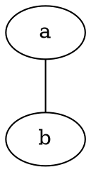

# Example document

See: \ref{the_example}


```{.dot caption="example graph." label="the_example"}

graph graphname {
	 a [texlbl="$\alpha$"];
	 b [texlbl="$\beta$"];
	 b1 [texlbl="$\beta_1$"];
	 b2 [texlbl="$\beta_2$"];
     a -- b
     b -- b1
	 b -- b2
 }
```





```{.dot scale="0.5"}
graph tall{
	a -- b -- c -- d -- e -- f -- g
}
```
